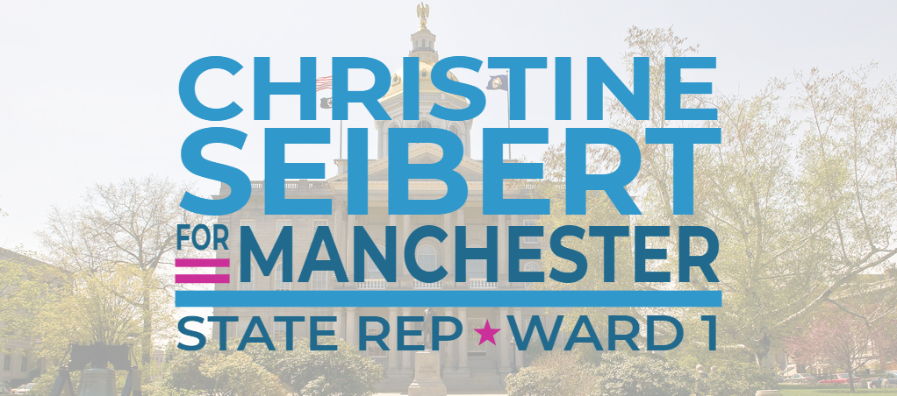

# :material-vote: Re-Elect Christine Seibert as your New Hampshire State Representative

{ loading=lazy }

## Hillsborough District 21

As your State Representative, I will continue to listen and fight for your concerns, promote values
that benefit our community, and bring common sense to the State House.

## :material-account-supervisor-circle: Serving you honestly and thoughtfully with results in mind

I, **[Christine Seibert](https://gencourt.state.nh.us/house/members/member.aspx?pid=9077)**, am a
proud member of the [Democratic Party](https://democrats.org/) who is actively serving in the
[New Hampshire House of Representatives](https://gencourt.state.nh.us/house/), representing
*Hillsborough 21 (Manchester Ward 1)*, and I am asking for your vote for re-election this November
5th, 2024.

Having sponsored or co-sponsored around thirty (30) bills, five (5) of which were Signed, Enacted,
or Adopted into law, and one other that was sadly Vetoed by the Governor, I am very proud of the
work I did for you in my first term in office.

As an At-Large Member of the NH House Progressive Caucus, I tracked our members' votes for
leadership to identify new members and ensure the integrity of progressives in the State House.

As a member of the
[State-Federal Relations and Veterans Affairs Committee](https://www.gencourt.state.nh.us/house/committees/committeedetails.aspx?id=16),
I fought hard to support our Veterans, National Guard, and other military or veterans' organizations
within the state. This is personal for me, coming from a Veteran household and family where both my
Father (US Army Veteran) and Husband (US Navy Veteran) proudly served our country. While we may
disagree on wars and how we got there, we still owe it to our Veterans to take care of them.

> See [Bill Track 50](https://www.billtrack50.com/legislatordetail/27326) for my work and voting
> record in the State House.

Collectively, as [NH House Democrats](https://nhhousedems.org/), we have accomplished some great
wins this last session, including but not limited to:

- **PASSED** Bail Reform: [HB 318](https://www.gencourt.state.nh.us/bill_status/billinfo.aspx?id=435&inflect=2)
- **DEFEATED** a Book Ban: [HB 1419](https://www.gencourt.state.nh.us/bill_status/billinfo.aspx?id=1471&inflect=2)
- **PASSED** PFAS Regulations: [HB 1649](https://www.gencourt.state.nh.us/bill_status/billinfo.aspx?id=1894&inflect=2)
- **DEFEATED** Universal School Vouchers [HB 331](https://www.gencourt.state.nh.us/bill_status/legacy/bs2016/billText.aspx?sy=2023&id=203&txtFormat=html) and [HB 1634](https://www.gencourt.state.nh.us/bill_status/billinfo.aspx?id=1890&inflect=2)
- **DEFEATED** Multiple Abortion Bans: [HB 591](https://www.gencourt.state.nh.us/bill_status/legacy/bs2016/billText.aspx?sy=2023&id=265&txtFormat=html), [HB 1248](https://www.gencourt.state.nh.us/bill_status/billinfo.aspx?id=1299&inflect=2), and [HB 1541](https://www.gencourt.state.nh.us/bill_status/billinfo.aspx?id=1589&inflect=2)

We still have more work to do, and I look forward to continuing to listen to you and fighting for
you in the **New Hampshire House of Representatives** for another term!
