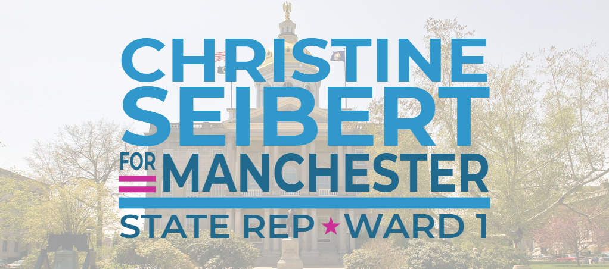

# :material-vote: Re-Elect Christine Seibert as your New Hampshire State Representative

{ loading=lazy }

## :material-image-area: Hillsborough District 21

As your State Representative, I will continue to listen and fight for your concerns, promote values
that benefit our community, and bring common sense to the State House.

## :material-account-supervisor-circle: Serving you honestly and thoughtfully with results in mind

I, **[Christine Seibert](https://gencourt.state.nh.us/house/members/member.aspx?pid=9077)**, am a
proud member of the [Democratic Party](https://democrats.org/) who is actively serving in the
[New Hampshire House of Representatives](https://gencourt.state.nh.us/house/), representing
*Hillsborough 21 (Manchester Ward 1)*, and I am asking for your vote for your support in this upcoming
election.

- State Primary Election - September 8, 2026
- State General Election - November 3, 2026

As the Ranking Member for the Democrats in the
[State-Federal Relations and Veterans Affairs Committee](https://www.gencourt.state.nh.us/house/committees/committeedetails.aspx?id=16),
we have worked hard to find common ground when it comes to supporting our Veterans, National
Guard, and their families. This is personal for me, coming from a family of Veterans where both my
Father (US Army Veteran) and Husband (US Navy Veteran) proudly served our country. Collectively,
we **PASSED** [HB1287](https://gc.nh.gov/bill_status/billinfo.aspx?id=2010&inflect=2)
revised the definition of "Veteran" in the State RSA to include both Honorable and General
(Under Honorable Conditions) discharge. This allows for all honorably discharged veterans the
rights to receive state benefits such as veteran plates and more.

As a member of our County Delegation, I was honored to be selected to on the Hillsborough County
Executive Committee, as well Chairing one of the Budget Subcommittees.

As the Secretary of the NH House Progressive Caucus, I tracked our members' votes for
leadership to identify new members and ensure the integrity of progressives in the State House.

Having sponsored or co-sponsored around thirty-two (32) bills/resolutions in this past term (2025-2026), six (6)
of which were Signed, Enacted, or Adopted into law, and two (2) House Resolutions Passed and were
Adopted with an Admendment. I am very proud of the work I did for you in this past term in office.

??? tip "Sponsored Bills Record from [Bill Track 50](https://www.billtrack50.com/legislatordetail/27326)"

    | Bill | Bill Name | Summary | Progress |
    | ---- |---------- | ------- | -------- |
    | [HB81](https://gc.nh.gov/bill_status/legacy/bs2016/bill_status.aspx?lsr=105&sy=2025&sortoption=&txtsessionyear=2025&ddlsponsors=409166) | Relative to consumption of beverages or liquor in areas not approved for service by the liquor commission. | This bill removes restrooms from the list of areas not approved for the serving or consumption of beverages or liquor. | Signed/Enacted/Adopted |
    | [HB167](https://gc.nh.gov/bill_status/legacy/bs2016/bill_status.aspx?lsr=141&sy=2025&sortoption=&txtsessionyear=2025&ddlsponsors=409166) | Prohibiting the sale of ski, boat, and board waxes that contain intentionally added per and polyfluorinated alkyl substances. | This bill prohibits the sale of ski, boat, and board waxes that contain intentionally added per and polyfluorinated alkyl substances. | Signed/Enacted/Adopted |
    | [HB631](https://gc.nh.gov/bill_status/legacy/bs2016/bill_status.aspx?lsr=683&sy=2025&sortoption=&txtsessionyear=2025&ddlsponsors=409166) | Permitting residential building in commercial zoning. | This bill requires municipalities to permit multi-family residential development on commercially zoned land, with stipulations for infrastructure and exemptions for adaptive reuse. | Signed/Enacted/Adopted |
    | [HB1172](https://gc.nh.gov/bill_status/billinfo.aspx?id=1672&inflect=2) | Relative to confidentiality protections for national guard sexual assault prevention and response personnel. | This bill expands the definition of sexual assault counselor under state law to include military and civilian sexual assault prevention and response personnel, thereby extending to them the confidentiality protections of the military rules of evidence. This bill is a request of the department of military affairs and veteran services. | Signed/Enacted/Adopted |
    | [HB1569](https://gc.nh.gov/bill_status/billinfo.aspx?id=1684&inflect=2) | Repealing the directive that the state sell the Anna Philbrook Center for Children property in Concord. | This bill repeals the requirement that the state sell the Anna Philbrook Center property located in Concord, New Hampshire. | Signed/Enacted/Adopted |
    | [SB492](https://gc.nh.gov/bill_status/billinfo.aspx?id=1246&inflect=2) | Authorizing the department of military affairs and veterans services to license and lease property in which the department holds a property interest. | This bill: I. Authorizes the department of military affairs and veterans services to lease or license property under its jurisdiction. II. Clarifies that when department property is leased or licensed to private entities that are not exempt from taxation, the property is subject to local property taxes as though privately owned. III. Outlines the responsibilities of lessees and licensees to pay taxes, the penalties for nonpayment, and the municipality's authority to enforce collection through liens and legal action. IV. Establishes a dedicated property fund for the department. | Signed/Enacted/Adopted |
    | [HR25](https://gc.nh.gov/bill_status/billinfo.aspx?id=1708&inflect=2) | Recognizing the Kingdom of Bhutan as responsible for the oppression and forced eviction of more than 100,000 Bhutanese citizens during the late 1980s and early 1990s. | Recognizing the Kingdom of Bhutan as responsible for the oppression and forced eviction of more than 100,000 Bhutanese citizens during the late 1980s and early 1990s. | Passed/Adopted with Amendment |
    | [HR26](https://gc.nh.gov/bill_status/billinfo.aspx?id=1626&inflect=2) | Supporting peace and stability in the Democratic Republic of the Congo. | Supporting peace and stability in the Democratic Republic of the Congo. | Passed/Adopted with Amendment |
    | [HB50](https://gc.nh.gov/bill_status/legacy/bs2016/bill_status.aspx?lsr=2&sy=2025&sortoption=&txtsessionyear=2025&ddlsponsors=409166) | Relative to intentional or knowing violation of the prohibition on teaching discrimination. | This bill provides that no education law of this state shall be construed to bar any school employee from teaching the historical or current experiences of any group that is protected from discrimination. The bill also repeals provisions of the law relating to the right to freedom from discrimination in public workplaces and education. | Dead |
    | [HB56](https://gc.nh.gov/bill_status/legacy/bs2016/bill_status.aspx?lsr=20&sy=2025&sortoption=&txtsessionyear=2025&ddlsponsors=409166) | Requiring a background check and mandatory waiting period during certain firearm transfers. | This bill requires firearm transfers to be subject to a criminal background check and a mandatory waiting period, subject to certain exceptions. | Dead |
    | [HB58](https://gc.nh.gov/bill_status/legacy/bs2016/bill_status.aspx?lsr=25&sy=2025&sortoption=&txtsessionyear=2025&ddlsponsors=409166) | Establishing a committee to study legislative protections and accommodations for individuals with long COVID. | This bill establishes a committee to study legislative protections and accommodations for individuals with long COVID. | Dead |
    | [HB106](https://gc.nh.gov/bill_status/legacy/bs2016/bill_status.aspx?lsr=28&sy=2025&sortoption=&txtsessionyear=2025&ddlsponsors=409166) | Establishing a commission to determine the monetary costs of climate damage to the state of New Hampshire and the best means of recouping such costs. | This bill establishes a commission to determine the financial cost of climate damage to New Hampshire and methods of recouping such costs. | Dead |
    | [HB201](https://gc.nh.gov/bill_status/legacy/bs2016/bill_status.aspx?lsr=31&sy=2025&sortoption=&txtsessionyear=2025&ddlsponsors=409166) | Prohibiting the removal of claws from cats. | This bill creates a criminal penalty for declawing a cat. | Dead |
    | [HB226](https://gc.nh.gov/bill_status/legacy/bs2016/bill_status.aspx?lsr=267&sy=2025&sortoption=&txtsessionyear=2025&ddlsponsors=409166) | Relative to the use of drug checking equipment. | This bill amends and adds definitions to the Controlled Drug Act to exclude drug checking equipment from being considered drug paraphernalia and authorizes the use of drug checking equipment. | Dead |
    | [HB343](https://gc.nh.gov/bill_status/legacy/bs2016/bill_status.aspx?lsr=657&sy=2025&sortoption=&txtsessionyear=2025&ddlsponsors=409166) | Relative to reporting regarding the northern border alliance program. | This bill adds specific reporting requirements to the semi-annual report regarding the northern border alliance program. | Dead |
    | [HB380](https://gc.nh.gov/bill_status/legacy/bs2016/bill_status.aspx?lsr=445&sy=2025&sortoption=&txtsessionyear=2025&ddlsponsors=409166) | Relative to penalties for criminal violations of the therapeutic use of cannabis. | This bill amends the penalty for the unauthorized sale of cannabis by a qualifying patient or designated caregiver. | Dead |
    | [HB442](https://gc.nh.gov/bill_status/legacy/bs2016/bill_status.aspx?lsr=857&sy=2025&sortoption=&txtsessionyear=2025&ddlsponsors=409166) | Relative to prohibiting payment of subminimum wages. | This bill prohibits payment of a base wage different than standard minimum wage for tipped workers earning more than $30 per month. | Dead |
    | [HB444](https://gc.nh.gov/bill_status/legacy/bs2016/bill_status.aspx?lsr=862&sy=2025&sortoption=&txtsessionyear=2025&ddlsponsors=409166) | Relative to a tenant's right to notification prior to the sale of a multi-family home. | This bill requires the owner of restricted multi-family residential property to provide tenants with notice of sale of the property and an opportunity to make an offer to purchase the property. | Dead |
    | [HB490](https://gc.nh.gov/bill_status/legacy/bs2016/bill_status.aspx?lsr=766&sy=2025&sortoption=&txtsessionyear=2025&ddlsponsors=409166) | Relative to indemnification for municipalities adopting policies to address homelessness. | This bill allows public property to be used to aid and shelter the homeless and indemnifies the governmental unit from claims for injury related to such aid and shelter absent intentional misconduct or a conscious disregard for safety. | Dead |
    | [HB558](https://gc.nh.gov/bill_status/legacy/bs2016/bill_status.aspx?lsr=837&sy=2025&sortoption=&txtsessionyear=2025&ddlsponsors=409166) | Creating a public county registry of the monthly rent charged by landlords for each owned unit and prohibiting landlords from using algorithms or software to determine rental rates. | This bill creates a public registry of rents and prohibits landlords from using any algorithms or software to determine rental rates, and requires an affidavit attesting to compliance. | Dead |
    | [HB623](https://gc.nh.gov/bill_status/legacy/bs2016/bill_status.aspx?lsr=662&sy=2025&sortoption=&txtsessionyear=2025&ddlsponsors=409166) | Relative to prohibiting corporations from purchasing single-family homes for a certain amount of time. | This bill restricts the acquisition of single-family and multi-family housing to natural persons with certain exceptions. It requires any non-natural person acquiring such housing under these exceptions to register and file reports with the secretary of state. | Dead |
    | [HB646](https://gc.nh.gov/bill_status/legacy/bs2016/bill_status.aspx?lsr=23&sy=2025&sortoption=&txtsessionyear=2025&ddlsponsors=409166) | Requiring school districts to establish an online application for participation in the free and reduced price meal program. | This bill directs the department of education to adopt rules to require school districts to offer online and physical free or reduced price school meals applications. It also requires the department to provide administrative and technical assistance to districts for this purpose and makes an appropriation therefor. | Dead |
    | [HB726](https://gc.nh.gov/bill_status/legacy/bs2016/bill_status.aspx?lsr=693&sy=2025&sortoption=&txtsessionyear=2025&ddlsponsors=409166) | Relative to the state minimum hourly rate. | This bill increases the minimum hourly rate and increases the base rate for tipped employees. | Dead |
    | [HB1049](https://gc.nh.gov/bill_status/billinfo.aspx?id=1648&inflect=2) | Relative to storage requirements for firearms. | This bill requires firearms to be securely stored when not in use to prevent unauthorized access by minors. It also requires that a locking safety device accompany all private and commercial firearms transactions and expands the criminal penalties for negligent storage of firearms. | Dead |
    | [HB1080](https://gc.nh.gov/bill_status/billinfo.aspx?id=1799&inflect=2) | Prohibiting the sale of condoms and personal lubricant that contain intentionally added per and polyfluoroalkyl substances. | This bill prohibits the sale of condoms and personal lubricant that contains intentionally added per and polyfluoroalkyl substances. | Dead |
    | [HB1387](https://gc.nh.gov/bill_status/billinfo.aspx?id=2397&inflect=2) | Repealing limiting liability for certain design features of firearms. | This bill repeals limiting liability for certain design features of firearms. | Dead |
    | [HB1484](https://gc.nh.gov/bill_status/billinfo.aspx?id=1898&inflect=2) | Establishing a state minimum wage and providing for incremental increases. | This bill establishes a state minimum wage and provides for incremental increases. | Dead |
    | [HB1609](https://gc.nh.gov/bill_status/billinfo.aspx?id=1638&inflect=2) | Limiting the use of state, county, and municipal funds and property for construction and operation of certain immigrant detention facilities. | This bill places restrictions on the use of state, county, and municipal funds and property for the purpose of detention of immigrants. | Dead |
    | [HB1642](https://gc.nh.gov/bill_status/billinfo.aspx?id=2260&inflect=2) | Relative to extreme risk protection orders. | This bill establishes a procedure for issuing extreme risk protection orders to protect against persons who pose an immediate risk of harm to themselves or others. | Dead |
    | [HCR7](https://gc.nh.gov/bill_status/legacy/bs2016/bill_status.aspx?lsr=743&sy=2025&sortoption=&txtsessionyear=2025&ddlsponsors=409166) | Recognizing abortion as a critical component of comprehensive reproductive health care. | Recognizing abortion as a critical component of comprehensive reproductive health care. | Dead |
    | [HR46](https://gc.nh.gov/bill_status/billinfo.aspx?id=1940&inflect=2) | Declaring the first Friday in June as a state day of remembrance for children killed by gun violence and urging the establishment of a national day of remembrance. | Declaring the first Friday in June as a state day of remembrance for children killed by gun violence and urging the establishment of a national day of remembrance. | Dead |

Collectively, as [NH House Democrats](https://nhhousedems.org/), we have accomplished some great
wins this last session, including but not limited to:

- **DEFEATED** a Book Ban: [HB 1419](https://www.gencourt.state.nh.us/bill_status/billinfo.aspx?id=1471&inflect=2)
- **PASSED** PFAS Regulations: [HB 1649](https://www.gencourt.state.nh.us/bill_status/billinfo.aspx?id=1894&inflect=2)
- **DEFEATED** Universal School Vouchers: [HB 331](https://www.gencourt.state.nh.us/bill_status/legacy/bs2016/billText.aspx?sy=2023&id=203&txtFormat=html) and [HB 1634](https://www.gencourt.state.nh.us/bill_status/billinfo.aspx?id=1890&inflect=2)
- **DEFEATED** Multiple Abortion Bans: [HB 591](https://www.gencourt.state.nh.us/bill_status/legacy/bs2016/billText.aspx?sy=2023&id=265&txtFormat=html), [HB 1248](https://www.gencourt.state.nh.us/bill_status/billinfo.aspx?id=1299&inflect=2), and [HB 1541](https://www.gencourt.state.nh.us/bill_status/billinfo.aspx?id=1589&inflect=2)

We still have more work to do, and I look forward to continuing to listen to you and fighting for
you in the **New Hampshire House of Representatives** for another term!
