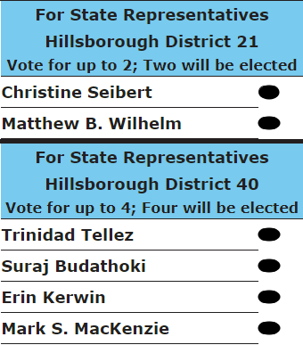

# :fontawesome-solid-flag-usa: Vote

Although it is a Presidential Election, it is vital to vote Democrats down the ballot to ensure you
get the outcomes you are expecting according to the
[US Vote Foundation](https://www.usvotefoundation.org/downballot).

> Let's get out there and vote **Democrats** from the *bottom* of the ticket *up*!

=== "County Commissioner"

    - [x] Jeffrey Monheit

=== "Register of Probate"

    - [x] Tony Labranche

=== "Register of Deeds"

    - [x] [Mary Ann Crowell](https://www.nashuatelegraph.com/news/local-news/2022/10/22/deeds-going-digital-arpa-funding-makes-possible-the-digitizing-preservation-of-hundreds/)

=== "County Treasurer"

    - [x] [Beverly Cotton](https://www.opendemocracyaction.org/who_we_are)

    > Read [Weare Democrats | Meet Our 2024 Candidates](https://wearenhdemocrats.org/meet-our-2024-candidates/) for more details on Bev.

=== "County Attorney"

    - [x] [Kimberly A. Kossick](https://www.kkossickhcao2024.com/)

===+ "State Representatives"

    **Vote for ALL 6. Six will be elected**

    <h5>District 21 (Manchester Ward 1)</h5>

    - [x] [Christine Seibert](https://www.gencourt.state.nh.us/house/members/member.aspx?pid=9077)*
    - [x] [Matthew B. Wilhelm](https://www.facebook.com/WilhelmForNH/)

    <h5>District 40 (Manchester Wards 1, 3, 10, 11, 12)</h5>

    - [x] [Trinidad Tellez](https://www.facebook.com/DoctorTrini4NH/)
    - [x] [Suraj Budathoki](https://www.surajbudathoki.org/)
    - [x] [Erin Kerwin](https://www.facebook.com/people/Erin-Kerwin-for-State-Representative/61560611957169/)
    - [x] [Mark S. MacKenzie](https://www.gencourt.state.nh.us/house/members/member.aspx?pid=8516)*

    > `*` Represents a link to the Official General Court Website

=== "State Senate"

    - [x] [Michael York](https://manchester.inklink.news/michael-york-retiring-state-librarian-announces-run-for-nh-senate-district-16/)

=== "Executive Councilor"

    - [x] [Jim O'Connell](https://oconnellfornh.com/)

=== "Representative in Congress"

    - [x] [Chris Pappas](https://www.chrispappas.org/)

=== "Governor"

    - [x] [Joyce Craig](https://joycecraig.org/)

=== "President"

    - [x] [Kamala Harris](https://kamalaharris.com/)

## :material-ballot: Sample Ballot

Vote for All **Six (6)** *New Hampshire State Representatives*!

> Download a [Sample Ballot](https://www.sos.nh.gov/elections/sample-ballots/) from the New
> Hampshire Secretary of States (SoS) Website or use the [Blue Voter Guide](https://bluevoterguide.org/) by providing your address.

## :material-calendar-check: When to Vote

I encourage you to vote in both the Primary & General Elections so we can elect the Democrats:

- **Primary Election**: September 10, 2024
- **General Election**: November 5, 2024

## :fontawesome-solid-school: Where to Vote

- **Polling Place**: [WEBSTER SCHOOL AUDITORIUM](http://maps.google.com/?q=2519%20%20ELM%20ST,%20MANCHESTER,%20NH%2003104)
- **Polling Address**: [2519 ELM ST, MANCHESTER, NH 03104](http://maps.google.com/?q=2519%20%20ELM%20ST,%20MANCHESTER,%20NH%2003104)
- **Polling Hours**: 6:00 AM - 7:00 PM

> Bring Your State-Issued Photo ID (passports also work)

## :material-registered-trademark: Absentee Voting and Registration

Please see the following link for absentee voting instructions and registration:

- [Secretary of State - Absentee Ballots](https://www.sos.nh.gov/elections/absentee-ballots)
- [Secretary of State - Absentee Ballot Application](https://www.sos.nh.gov/sites/g/files/ehbemt561/files/documents/2024-07/2024-absentee-ballot-application-state-election-remediation-update.pdf)
- [How to Register to Vote](https://www.manchesternh.gov/Departments/City-Clerk/Voter-Registration-and-Elections/How-to-Register)
- [Secretary of State - Register to Vote](https://www.sos.nh.gov/elections/register-vote)
- [Are you Registered?](https://www.manchesterdemocrats.org/voterreg)

## :material-handshake: Interested in Helping?

Poll Workers are always needed here in the Queen City.  If you are interested in finding out more
and how to apply, please check it out here:

- [Election Official and Poll Worker Information](https://www.manchesternh.gov/Departments/City-Clerk/Voter-Registration-and-Elections/Election-Official-and-Poll-Worker-Information)

## :material-information-outline: Resources

- [Secretary of State Voter Information](https://app.sos.nh.gov/voterinformation)
- [Where do I Vote?](https://www.manchesternh.gov/Departments/City-Clerk/Voter-Registration-and-Elections/Where-do-I-Vote)
- [Voter Registration and Elections](https://www.manchesternh.gov/Departments/City-Clerk/Voter-Registration-and-Elections)
- [Secretary of State Elections](https://www.sos.nh.gov/elections)
